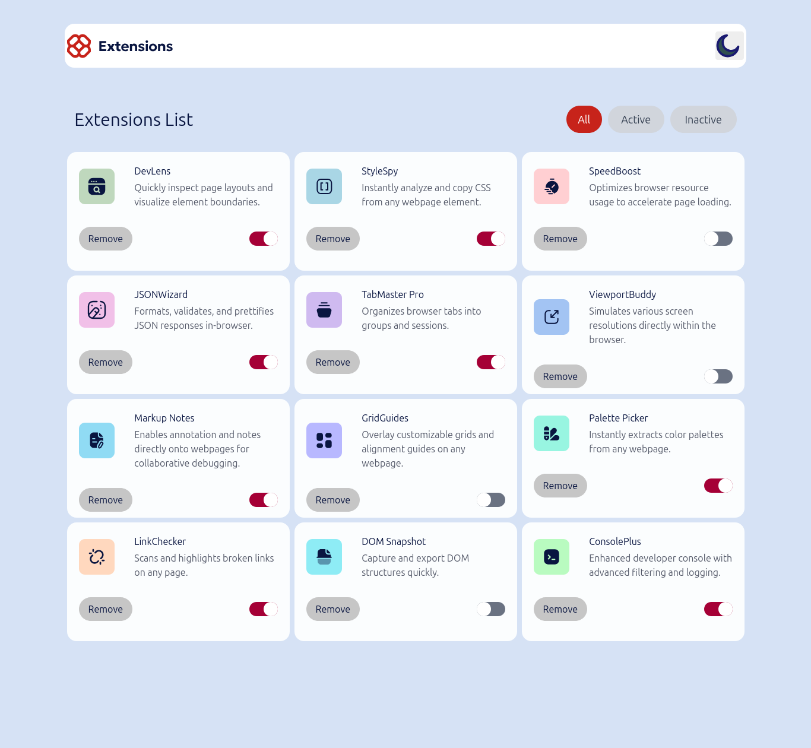

# Frontend Mentor - Browser extensions manager UI solution

This is a solution to the [Browser extensions manager UI challenge on Frontend Mentor](https://www.frontendmentor.io/challenges/browser-extension-manager-ui-yNZnOfsMAp). Frontend Mentor challenges help you improve your coding skills by building realistic projects. 

## Table of contents

- [Overview](#overview)
  - [The challenge](#the-challenge)
  - [Screenshot](#screenshot)
  - [Links](#links)
- [My process](#my-process)
  - [Built with](#built-with)
  - [What I learned](#what-i-learned)
- [Author](#author)

**Note: Delete this note and update the table of contents based on what sections you keep.**

## Overview

### The challenge

Users should be able to:

- Toggle extensions between active and inactive states
- Filter active and inactive extensions
- Remove extensions from the list
- Select their color theme
- View the optimal layout for the interface depending on their device's screen size
- See hover and focus states for all interactive elements on the page

### Screenshot

### Links

- Solution URL: [https://github.com/CoderAlchemy24/frm-browser-extensions.git](https://github.com/CoderAlchemy24/frm-browser-extensions.git)
- Live Site URL: [https://harmonious-conkies-39c7db.netlify.app/](https://harmonious-conkies-39c7db.netlify.app/)

## My process

### Built with

- [React](https://reactjs.org/) - JS library
- TailwindCSS and custom CSS properties

### What I learned

TailwindCSS

## Author

- Website - [coderalchemy24](https://github.com/coderalchemy24)

